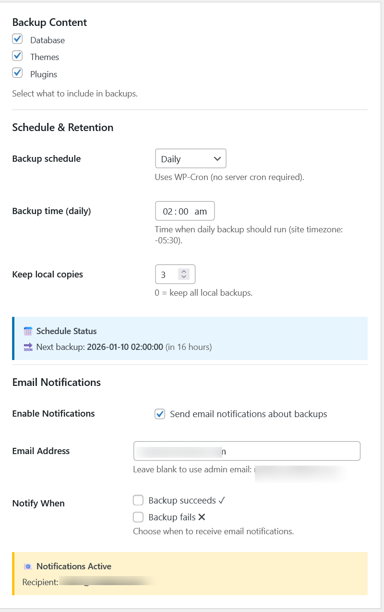

# ZATA S3 WordPress Backup (Open Source)
ZATA S3 WordPress Backup is an open-source WordPress plugin that backs up your **Database, Themes, and Plugins** as **separate ZIP files** and uploads them to **ZATA S3** or any **S3-compatible object storage**.

The plugin is designed to be **simple, transparent, and professional**, with logs, scheduling, and email notifications.

---
## Features
- Separate ZIP backups:- `Database (database.sql inside ZIP)`, `Themes (wp-content/themes)`, `Plugins (wp-content/plugins)`
- Upload to **ZATA S3** (Central India preset included)
- Works with **S3-compatible storage**
- Built-in scheduling (WP-Cron)
- Manual "Run Backup Now"
- Email notifications (failure / optional success)
- Logs & backup history
- Admin-only access with WordPress nonces
- No external SDK dependencies

---
## Installation
1. Download or clone this repository.
2. Upload the plugin folder: `wp-s3-backup/` to: `wp-content/plugins/`
3. Activate **ZATA S3 WordPress Backup** from: **WordPress Admin > Plugins**
4. Open: **ZATA S3 Backup** from the admin sidebar.

---
## ZATA Preset (Default)
The plugin includes a ready-to-use ZATA preset.
Default values:
- Endpoint: `https://idr01.zata.ai`
- Region: `CentralIndia`
- Path-style addressing: `Enabled`
- Key prefix: `wp-backups`

### You only need to add:
- Bucket name
- Access Key
- Secret Key
---
## Where to add Access Key & Secret Key
Go to: ZATA S3 Backup > Settings > S3 / Object Storage
### Fields:
- Access Key
- Secret Key
> Recommendation: Use credentials limited to the backup bucket only.

---
## Backup Output Structure
Backups are uploaded as:
```
s3://<bucket>/<prefix>/db/<site>-db-YYYYMMDD-HHMMSS.zip
s3://<bucket>/<prefix>/themes/<site>-themes-YYYYMMDD-HHMMSS.zip
s3://<bucket>/<prefix>/plugins/<site>-plugins-YYYYMMDD-HHMMSS.zip
```

### Local copies (optional) are stored in:
```wp-content/uploads/wps3b-backups/```

---
## Restore Process (Manual)
1. Download required ZIP files from S3.
2. Restore files:
- Extract `themes.zip` → `wp-content/themes/`
- Extract `plugins.zip` → `wp-content/plugins/`
3. Restore database:
- Extract `database.sql`
- Import into MySQL using phpMyAdmin or CLI

---
## Logs \& History
- View recent backup runs under: ZATA S3 Backup → Logs
- Includes:
- Timestamp
- Status (SUCCESS / FAILED)
- Duration
- Uploaded objects
- Download or clear logs from the UI

---
## Scheduling
Supported schedules:
- Disabled
- Hourly
- Twice Daily
- Daily
- Weekly
- Custom interval (minutes)

> WordPress uses WP-Cron.  
> For accurate timing, trigger `wp-cron.php` using a system cron job.

---
## Security Notes
- Admin-only access (`manage\_options`)
- WordPress nonces for all actions
- Backup directory protected with:
- `index.php`
- `.htaccess`
- No public endpoints
- Secrets are never logged

### Recommended Hardening
- Store credentials in `wp-config.php` (future enhancement)
- Restrict bucket permissions
- Disable insecure TLS unless required

---
## License
MIT License
Copyright (c) 2026 radheneev
See the `LICENSE` file for full license text.

---
## Disclaimer
This software is provided **"as is"**, without warranty of any kind.  
Use at your own risk.

## Screenshots
### 1) S3 / ZATA Settings

### 2) Schedule Setup



